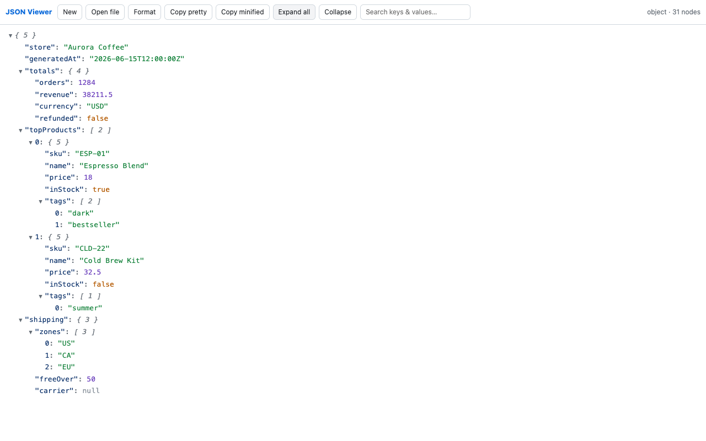

# JSON Viewer & Formatter — for large files

A fast, private JSON viewer and formatter that stays smooth on **large files** — the ones that freeze your browser, DevTools, or the usual online formatters.

**▶ Use it: https://myastroapp.github.io/json-viewer/**

## Why
Most online JSON tools were built for small snippets. Paste a few megabytes of API response or a log export and they hang, crash the tab, or quietly upload your data to a server. This one renders large documents incrementally (the tree builds in chunks as you expand it) and keeps **everything in your browser** — nothing is uploaded. The source is right here, so that privacy claim is verifiable.

## Tools
- **[JSON viewer](https://myastroapp.github.io/json-viewer/app.html)** — collapsible tree, instant search across keys and values, beautify/minify, built for big files.
- **[JSON → CSV converter](https://myastroapp.github.io/json-viewer/json-to-csv.html)** — turn an array of objects into a clean CSV for Excel or Sheets.
- **[JSONPath tester](https://myastroapp.github.io/json-viewer/jsonpath.html)** — evaluate paths like `data.items[*].name` against your JSON.

## Privacy
No accounts, no analytics, no tracking, no network requests of its own. Everything runs locally in your browser.

## Pro
A one-time Pro unlock adds JSONPath querying and CSV/Excel export inside the big-file viewer. Everything else is free.

## More free tools
- [Finance calculators](https://myastroapp.github.io/rental-calculator/) — rental property, mortgage, affordability, payoff
- [Invoice / estimate / receipt generator](https://myastroapp.github.io/invoice-generator/) — free, no sign-up
- [Resume builder + cover letter + ATS checker](https://myastroapp.github.io/resume-builder/) — free, private
